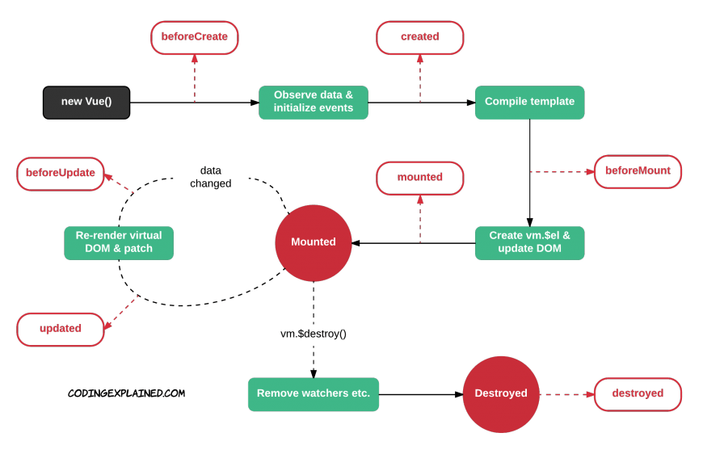
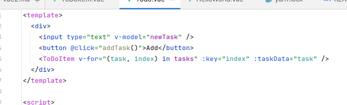
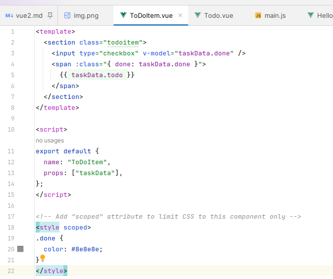

- Refer: https://vuejs.org/api/
-
- 2 way binding element:
    + Bind du lieu 2 chieu
    + Phu thuoc vao kieu input

- Lifecycle

- Binding
    + Value binding: {{ }}
    + property binding:
    + v-bind:ten_thuoc_tinh="bien_thuoc_tinh"
      Viết tắt/ :ten_thuoc_tinh="bien_thuoc_tinh
    + Style & Clasing binding

- Model
    + Lien ket element vs property

- Directives

- Event Handling
    + Trigger event
    + v-on:ten_su_kien="function()"
      Viết tắt: @
    + Prevent default event
      @submit.prevent
      @click.prevent / @click.prevent.debounce
    + Ref(): anh xa. den element

- Conditional rendering:
    + v-show: An/Hien 1 element theo dieu kien
    + v-hide: nguoc lai
    + v-if: An/Hien 1 element theo dieu kien
    + v-el:
    + v-model: Create a two-way binding on a form input element or a component

- List rendering:
    + v-for

- Methods
    + Function of vue object

- Watch
    + Theo doi su thay doi cua data

- Hooks
  
    + **beforeCreate**: Được gọi ngay sau khi thể hiện vue được khởi tạo và trước khi đẩy vào data và các event/watcher
      được
      thêm vào
    + **created**: Được gọi ngay khi một thể hiện của vue được tạo ra. Ở trạng thái này, thể hiện vue đã hoàn thành, bao
      gồm
      việc tính dữ liệu data, các thuộc tính tính toán trong computed, các phương thức viết trong methods, các
      event/watch. Tuy nhiên mounting chưa bắt đầu, và biến đặc biệt $el chưa khả dụng
    + **beforeMount**: Được gọi ngay trước khi quá trình mounting được bắt đầu. function này chỉ được gọi đến môt lần
      trong quá trình render. (same use Effect)
    + **mounted**: _Similar to React's componentDidMount._ Vue calls the mounted() hook when your component is added to
      the DOM. It is most often used to send
      an
      HTTP request to fetch data that the component will then render.
    + **beforeUpdate**: Chi tiết Được gọi ngay khi dữ liệu dược thay đổi, trước khi DOM được cập nhật. Có thể truy cập
      đến trạng thái trước khi cập nhật của DOM.
    + **updated**: _Similar to React's componentDidUpdate._ Được gọi khi dữ liệu được thay đổi và DOM sẽ được render lại
      và cập nhật lại.
    + **beforeDestroy**
    + **destroyed**: _Similar to React's componentWillUnmount_

- Props (Same same data() in script)
    + Data lay tu component cha pass to component con
    + Dùng mảng tên các data
      
      
    + Objects

- State management
    + Vue also has a Flux-based state management library called Vuex. Again, it’s similar to Redux, but has a number of
      differences.

